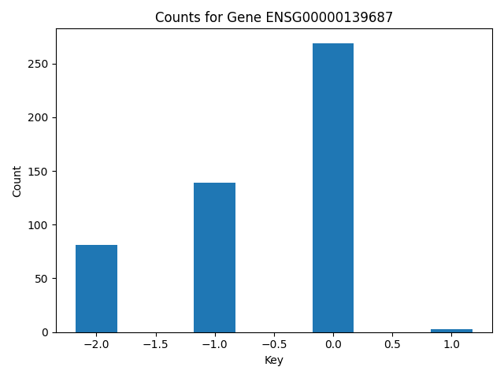

```python
import matplotlib.pyplot as plt
import numpy as np
import gripql
conn = gripql.Connection("https://bmeg.io/api", credential_file="bmeg_credentials.json")
G = conn.graph("rc6_1")
```

Get Ensembl Gene ids for genes of interest


```python
GENES = ["PTEN", "TP53", "RB1"]
gene_ids = {}
for g in GENES:
    for i in G.V().hasLabel("Gene").has(gripql.eq("symbol", g)):
        gene_ids[g] = i["_id"]
```

```python
gene_ids
```

    {'PTEN': 'ENSG00000171862',
     'TP53': 'ENSG00000141510',
     'RB1': 'ENSG00000139687'}


For each gene of interest, obtain the copy number alteration values and aggregate them by gene.


```python
q = G.V("Project:TCGA-PRAD").out("cases").out("samples").out("aliquots")
q = q.has(gripql.eq("$.gdc_attributes.sample_type", 'Primary Tumor')).out("copy_number_alterations")
q = q.aggregate(
    list( gripql.term( g, "values.%s" % (g), 5) for g in gene_ids.values() )
)

res = list(q)
for item in res:
    print(f"{item['name']}\t{item['key']}:{item['value']}")

```
ENSG00000171862	0:327
ENSG00000171862	-2:95
ENSG00000171862	-1:64
ENSG00000171862	1:5
ENSG00000171862	2:1
ENSG00000141510	0:329
ENSG00000141510	-1:126
ENSG00000141510	-2:37
ENSG00000139687	0:269
ENSG00000139687	-1:139
ENSG00000139687	-2:81
ENSG00000139687	1:3


Create a barchart showing the counts of copy number altered samples in the cohort.


```python

val = []
count = []
gene_data = [item for item in res if item['name'] == 'ENSG00000139687']
sorted_data = sorted(gene_data, key=lambda x: x['key'])
val = [item['key'] for item in sorted_data]
count = [item['value'] for item in sorted_data]
plt.bar(val, count, width=0.35)
plt.xlabel("Key")
plt.ylabel("Count")
plt.title("Counts for Gene ENSG00000139687")
plt.tight_layout()
plt.show()
```




```python

```
