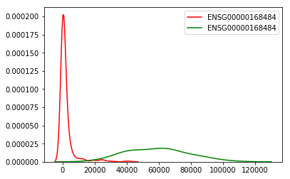

```python
import matplotlib.pyplot as plt
import seaborn as sns
import pandas
from scipy.stats import ttest_ind
import gripql
```


```python
conn = gripql.Connection("https://bmeg.io/api", credential_file="bmeg_credentials.json")
O = conn.graph("bmeg_rc2")
```

Look at the expression in the [TCGA LUAD project](https://portal.gdc.cancer.gov/projects/TCGA-LUAD)


```python
PROJECT="Project:TCGA-LUAD"
```

Starting from the TCGA-LUAD project, follow the edges from `Project` -> `Case` -> `Sample` -> `Aliquot` -> `GeneExpression`. At the `Sample` node, we select from `Solid Tissue Normal` so we only pull the normals during this query.

Once on the gene expression node, extract the `values`, which hold the gene expression values in a Map[String,Float] format with Ensembl Gene ids as the keys, and the Gene expression TPMs as the values. We then load that into a Pandas data frame, and transpose so that the rows are the sample ids.


```python
c = O.query().V(PROJECT).out("cases").out("samples").as_("sample")
c = c.has(gripql.eq("gdc_attributes.sample_type", "Solid Tissue Normal"))
c = c.out("aliquots").out("gene_expressions").as_("exp")
c = c.render( ["$sample._data.gdc_attributes.submitter_id", "$exp._data.values"])
data = {}
for row in c.execute(stream=True):
    data[row[0]] = row[1]
normalDF = pandas.DataFrame(data).transpose()
```

    [INFO]	2019-07-26 20:44:50,476	59 results received in 12 seconds


Do the Project to Gene Expression traversal again, but this time only select the tumor samples.


```python
c = O.query().V(PROJECT).out("cases").out("samples").as_("sample")
c = c.has(gripql.eq("gdc_attributes.sample_type", "Primary Tumor"))
c = c.out("aliquots").out("gene_expressions").as_("exp")
c = c.render( ["$sample._data.gdc_attributes.submitter_id", "$exp._data.values"])
data = {}
for row in c.execute(stream=True):
    data[row[0]] = row[1]
tumorDF = pandas.DataFrame(data).transpose()
```

    [INFO]	2019-07-26 20:46:41,760	539 results received in 110 seconds


For each gene, run t-test to determine the genes with the most differential expression between the tumor and normal sets.


```python
stats = {}
for gene in tumorDF:
    s = ttest_ind(tumorDF[gene], normalDF[gene])
    stats[gene] = { 'statistic': s.statistic, 'pvalue' : s.pvalue }
statsDF = pandas.DataFrame(stats).transpose()
```

Display the results


```python
statsDF[ statsDF['pvalue'] < 0.0001 ].sort_values('statistic').head()
```


<div>
<style scoped>
    .dataframe tbody tr th:only-of-type {
        vertical-align: middle;
    }

    .dataframe tbody tr th {
        vertical-align: top;
    }

    .dataframe thead th {
        text-align: right;
    }
</style>
<table border="1" class="dataframe">
  <thead>
    <tr style="text-align: right;">
      <th></th>
      <th>pvalue</th>
      <th>statistic</th>
    </tr>
  </thead>
  <tbody>
    <tr>
      <th>ENSG00000168484</th>
      <td>6.625251e-227</td>
      <td>-53.352962</td>
    </tr>
    <tr>
      <th>ENSG00000135604</th>
      <td>5.332727e-208</td>
      <td>-48.705092</td>
    </tr>
    <tr>
      <th>ENSG00000204305</th>
      <td>1.356906e-197</td>
      <td>-46.256957</td>
    </tr>
    <tr>
      <th>ENSG00000114854</th>
      <td>1.756643e-188</td>
      <td>-44.172306</td>
    </tr>
    <tr>
      <th>ENSG00000022267</th>
      <td>5.421931e-173</td>
      <td>-40.745618</td>
    </tr>
  </tbody>
</table>
</div>


Using the top gene from the T-Test experiment (ENSG00000168484), plot the expression of the gene across the tumor and normal samples


```python
sns.kdeplot(tumorDF['ENSG00000168484'], color="r")
sns.kdeplot(normalDF['ENSG00000168484'], color="g")
```


    <matplotlib.axes._subplots.AxesSubplot at 0x7f272d6aeb38>





Do a quick search of `ENSG00000168484` to identify the Gene Ontology terms that it is linked to


```python
for row in O.query().V("ENSG00000168484").out("gene_ontology_terms"):
    print(row.gid, row.data.definition)
```

    [INFO]	2019-07-26 20:47:15,413	10 results received in 0 seconds


    GeneOntologyTerm:GO:0005515 Interacting selectively and non-covalently with any protein or protein complex (a complex of two or more proteins that may include other nonprotein molecules).
    GeneOntologyTerm:GO:0005576 The space external to the outermost structure of a cell. For cells without external protective or external encapsulating structures this refers to space outside of the plasma membrane. This term covers the host cell environment outside an intracellular parasite.
    GeneOntologyTerm:GO:0005615 That part of a multicellular organism outside the cells proper, usually taken to be outside the plasma membranes, and occupied by fluid.
    GeneOntologyTerm:GO:0042599 A membrane-bounded organelle, specialized for the storage and secretion of various substances (surfactant phospholipids, glycoproteins and acid phosphates) which are arranged in the form of tightly packed, concentric, membrane sheets or lamellae. Has some similar properties to, but is distinct from, a lysosome.
    GeneOntologyTerm:GO:0042802 Interacting selectively and non-covalently with an identical protein or proteins.
    GeneOntologyTerm:GO:0045334 A clathrin-coated, membrane-bounded intracellular vesicle formed by invagination of the plasma membrane around an extracellular substance.
    GeneOntologyTerm:GO:0097486 The volume enclosed by the outermost membrane of a multivesicular body.
    GeneOntologyTerm:GO:0005789 The lipid bilayer surrounding the endoplasmic reticulum.
    GeneOntologyTerm:GO:0007585 The process of gaseous exchange between an organism and its environment. In plants, microorganisms, and many small animals, air or water makes direct contact with the organism's cells or tissue fluids, and the processes of diffusion supply the organism with dioxygen (O2) and remove carbon dioxide (CO2). In larger animals the efficiency of gaseous exchange is improved by specialized respiratory organs, such as lungs and gills, which are ventilated by breathing mechanisms.
    GeneOntologyTerm:GO:0044267 The chemical reactions and pathways involving a specific protein, rather than of proteins in general, occurring at the level of an individual cell. Includes cellular protein modification.

