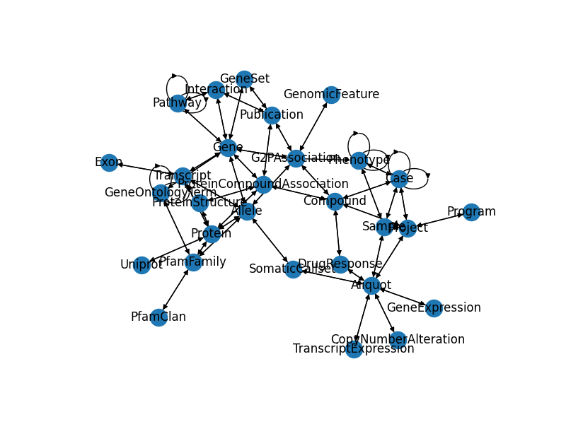

The GripQL API allows a user to download the schema of a graph. This outlines the different types of nodes, the edges the connect them and the structure of the documents stored in graph elements. A graph document has a `graph` field that has the name, a `vertices` field and an `edges` field.

```
{
 "graph": "rc5",
 "vertices": [
   {"_id": "Compound",
   "_label": "Compound",
   "name": "STRING",
   "term": "STRING",
   "term_id": "STRING"
   },
  ...],
  "edges": [
    {"_id": "(Project)--program->(Program)",
     "_label": "program",
     "_from": "Project",
     "_to": "Program",
     }
   ...]
}
```

Connect to BMEG server


```python
import networkx as nx
import matplotlib.pyplot as plt
import gripql
from networkx.drawing.nx_agraph import graphviz_layout
```


```python
conn = gripql.Connection("https://bmeg.io/api", credential_file="bmeg_credentials.json")
```

Print avalible graphs


```python
print(conn.listGraphs())
```

  ['rc6', 'rc6__schema__', 'rc6_1', 'rc6_1__schema__', 'rc5']


Get the schema graph


```python
schema = conn.getSchema("rc6_1")
```

Start build graph using [NetworkX](https://networkx.github.io/)


```python
g = nx.MultiDiGraph()
```


```python
for v in schema['vertices']:
    g.add_node(v['_id'])
for e in schema['edges']:
    g.add_edge(e['_from'], e['_to'])
```

Draw Schema Graph


```python
pos = graphviz_layout(g, prog='twopi', args='')
fig, ax = plt.subplots(1, 1, figsize=(8, 6));
nx.draw(g, pos, ax=ax, with_labels=True)
```

    /usr/local/lib/python3.7/site-packages/networkx/drawing/nx_pylab.py:563: MatplotlibDeprecationWarning:
    The iterable function was deprecated in Matplotlib 3.1 and will be removed in 3.3. Use np.iterable instead.
      if not cb.iterable(width):
    /usr/local/lib/python3.7/site-packages/networkx/drawing/nx_pylab.py:660: MatplotlibDeprecationWarning:
    The iterable function was deprecated in Matplotlib 3.1 and will be removed in 3.3. Use np.iterable instead.
      if cb.iterable(node_size):  # many node sizes





```python

```
